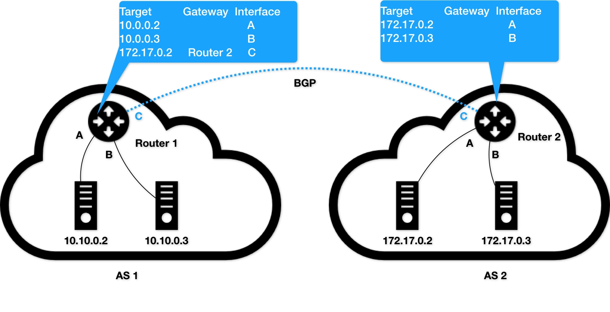

# Kubernetes

## 技能图谱


## 全局架构


## 核心功能


# 04 | 预习篇 · 小鲸鱼大事记（四）：尘埃落定

Swarm 擅长的是跟 Docker 生态的无缝集成，而 Mesos 擅长的则是大规模集群的调度与管理。

有状态应用部署框架 Operator

# 05 | 白话容器基础（一）：从进程说开去

容器本身没有价值，有价值的是“容器编排”

容器其实是一种沙盒技术

容器技术的核心功能，就是通过约束和修改进程的动态表现，从而为其创造出一个“边界”。

Cgroups 技术是用来制造约束的主要手段， 

Namespace 技术则是用来修改进程视图的主要方法。

Namespace 的使用方式也非常有意思：它其实只是 Linux 创建新进程的一个可选参数

Linux 操作系统提供了PID、Mount、UTS、IPC、Network 和 User 这些 Namespace，用来对各种不同的进程上下文进行“障眼法”操作

Mount Namespace，用于让被隔离进程只看到当前 Namespace 里的挂载点信息；

Network Namespace，用于让被隔离进程看到当前 Namespace 里的网络设备和配置

容器，其实是一种特殊的进程而已。单进程意思不是只能运行一个进程，而是只有一个进程是可控的。控制指的是它们的回收和生命周期管理。

# 06 | 白话容器基础（二）：隔离与限制

Namespace 技术实际上修改了应用进程看待整个计算机“视图”，即它的“视线”被操作系统做了限制，只能“看到”某些指定的内容。但对于宿主机来说，这些被“隔离”了的进程跟其他进程并没有太大区别。

用户运行在容器里的应用进程，跟宿主机上的其他进程一样，都由宿主机操作系统统一管理，只不过这些被隔离的进程拥有额外设置过的 Namespace 参数

基于 Linux Namespace 的隔离机制相比于虚拟化技术也有很多不足之处，其中最主要的问题就是：隔离得不彻底。

1) 既然容器只是运行在宿主机上的一种特殊的进程，那么多个容器之间使用的就还是同一个宿主机的操作系统内核。
2) 在 Linux 内核中，有很多资源和对象是不能被 Namespace 化的，最典型的例子就是：时间。

一个正在运行的 Docker 容器，其实就是一个启用了多个 Linux Namespace 的应用进程，而这个进程能够使用的资源量，则受 Cgroups 配置的限制。

Cgroups 对资源的限制能力也有很多不完善的地方，被提及最多的自然是 /proc 文件系统的问题

如果在容器里执行 top 指令，就会发现，它显示的信息居然是宿主机的 CPU 和内存数据，而不是当前容器的数据

原因就是，/proc 文件系统并不知道用户通过 Cgroups 给这个容器做了什么样的资源限制，即：/proc 文件系统不了解 Cgroups 限制的存在。

如何修复容器中的 top 指令以及 /proc 文件系统中的信息呢？（提示：lxcfs）

```
top 是从 /prof/stats 目录下获取数据，所以道理上来讲，容器不挂载宿主机的该目录就可以了。lxcfs就是来实现这个功能的，做法是把宿主机的 /var/lib/lxcfs/proc/memoinfo 文件挂载到Docker容器的/proc/meminfo位置后。容器中进程读取相应文件内容时，LXCFS的FUSE实现会从容器对应的Cgroup中读取正确的内存限制。从而使得应用获得正确的资源约束设定。kubernetes环境下，也能用，以ds 方式运行 lxcfs ，自动给容器注入争取的 proc 信息。

把宿主机的 /var/lib/lxcfs/proc/* 文件挂载到容器的/proc/*

容器上运行的java应用，由于当时jvm参数没正确配置上，就用默认的，而容器设置的内存为4g，最后oom了，当时用命令查看容器的内存占用情况，竟然发现内存竟然有60多g。 那应该显示的是宿主机的内存了，jvm按照宿主机内存大小分配的默认内存应该大于4g 所以还没full gc 就oom了
```


在从虚拟机向容器环境迁移应用的过程中，你还遇到哪些容器与虚拟机的不一致问题？

1. 性能损失

   ```
   可能的方案是用ipvs 替换iptables ，以及用 RPC 替换 rest。
   ```

   

2. 多租户隔离

docker里面跑的是容器entrypoint进程的子进程。docker基本上是旁路控制的作用

cgroups只能限制资源上限，不能锁定下限。所以才需要kubernetes 来帮你做调度嘛。


为什么说容器中无法同时运行两个不同的应用？实际上可以的。设置CMD参数为一个脚本，脚本中启动多个不同的进程。或者通过exec执行bash进入容器后，手动启动多个在后台运行的进程。

```
作者回复: 试想一下，你这么运行起来的后台进程异常退出后，你如何知晓？由于没没有真正的init进程，贸然这么运行起来的孤儿进程是非常棘手的
```

# 07 | 白话容器基础（三）：深入理解容器镜像

即使开启了 Mount Namespace，容器进程看到的文件系统也跟宿主机完全一样。

Mount Namespace 修改的，是容器进程对文件系统“挂载点”的认知。但是，这也就意味着，只有在“挂载”这个操作发生之后，进程的视图才会被改变。而在此之前，新创建的容器会直接继承宿主机的各个挂载点

Mount Namespace对容器进程视图的改变，一定是伴随着挂载操作（mount）才能生效。

Mount Namespace 正是基于对 chroot 的不断改良才被发明出来的，它也是 Linux 操作系统里的第一个 Namespace。

对 Docker 项目来说，它最核心的原理实际上就是为待创建的用户进程：

- 启用 Linux Namespace 配置；
- 设置指定的 Cgroups 参数；
- 切换进程的根目录（Change Root）。优先使用 pivot_root 系统调用，如果系统不支持，才会使用 chroot

rootfs 只是一个操作系统所包含的文件、配置和目录，并不包括操作系统内核。在 Linux 操作系统中，这两部分是分开存放的，操作系统只有在开机启动时才会加载指定版本的内核镜像

AuFS 的全称是 Another UnionFS，后改名为 Alternative UnionFS，再后来干脆改名叫作 Advance UnionFS

对于 AuFS 来说，它最关键的目录结构在 /var/lib/docker 路径下的 diff 目录：

```
/var/lib/docker/aufs/diff/<layer_id>
```


这里没有实验, 等有实验环境之后再重新看一遍

# 08 | 白话容器基础（四）：重新认识Docker容器

相关代码 ch08 目录

```shell
$ docker build -t helloworld .
$ docker image ls
REPOSITORY            TAG                 IMAGE ID
helloworld         latest              653287cdf998
$ docker run -p 4000:80 helloworld
$ docker ps
CONTAINER ID        IMAGE               COMMAND             CREATED
4ddf4638572d        helloworld       "python app.py"     10 seconds ago
$ curl http://localhost:4000
<h3>Hello World!</h3><b>Hostname:</b> 4ddf4638572d<br/>
```


# 09 | 从容器到容器云：谈谈Kubernetes的本质

而 Kubernetes 项目所擅长的，是按照用户的意愿和整个系统的规则，完全自动化地处理好容器之间的各种关系。这种功能，就是我们经常听到的一个概念：编排。

k8s是站在上帝视角俯视芸芸众生后的高度抽象，他看到了大概有哪些类人(组织）以及不同组织有什么样的特点（Job、CornJob、Autoscaler、StatefulSet、DaemonSet...），不同组织之间交流可能需要什么（ConfigMap,Secret...）,这样比价紧密的人们在相同pod中，通过Service-不会变更的手机号，来和不同的组织进行沟通，Deployment、RC则可以帮组人们快速构建组织。Dokcer 后出的swarm mode，有类似的视角抽象（比如Service），不过相对来说并不完善。

迁移可以简单分为两类：磁盘数据文件不变，进程重启；磁盘数据文件不变、内存数据也不变，相当于连带进程一起挪过去。第一种类型有很简单的方法：挂载云盘，从空间上解耦。第二种类型就复杂了，需要将内存数据一点点迁移过去，最后瞬间切换。IaaS很早就应用热迁移技术了。

Kubernetes则讨巧了，只着眼于应用，直接约定容器是可以随时被杀死的，热迁移就没有那么重要了。甚至连IP都隐藏了，又绕过了一个大难题

# 10 | Kubernetes一键部署利器：kubeadm

尝试

- ansible安装
- 源代码安装


有一个ansible playbook可以推荐给大家。
https://github.com/gjmzj/kubeasz
初学者可以跟着一步步看原理，后期还可以自己定制化。主要是容易产生兴趣。


我也补充一个可用于部署生产级别的Kubernetes的开源项目：https://github.com/kubernetes-incubator/kubespray 我们公司正在使用。

其实国内同学们用kubeadm安装集群最大的拦路虎在于有几个镜像没法下载，我建议大家先手动把镜像pull 下来，从阿里的镜像源上，然后tag成安装所需的镜像名称，这样你发现安装过程会异常顺利


kbueadm init 遇到问题的同学，可以从报错日志中获得需要的 镜像列表

\- No internet connection is available so the kubelet cannot pull or find the following control plane images:
                \- k8s.gcr.io/kube-apiserver-amd64:v1.11.4
                \- k8s.gcr.io/kube-controller-manager-amd64:v1.11.4
                \- k8s.gcr.io/kube-scheduler-amd64:v1.11.4
                \- k8s.gcr.io/etcd-amd64:3.2.18
                \- You can check or miligate this in beforehand with "kubeadm config images pull" to make sure the images

或者使用如下命令
kubeadm config images list

然后使用下边的脚本拉镜像并tag成指定Google的镜像

images=(
  k8s.gcr.io/kube-apiserver-amd64:v1.11.4
  k8s.gcr.io/kube-controller-manager-amd64:v1.11.4
  k8s.gcr.io/kube-scheduler-amd64:v1.11.4
  k8s.gcr.io/kube-proxy-amd64:v1.11.4
  k8s.gcr.io/pause:3.1
  k8s.gcr.io/etcd-amd64:3.2.18
  k8s.gcr.io/coredns:1.1.3
)

for imageName in ${images[@]} ; do
  docker pull registry.cn-hangzhou.aliyuncs.com/google_containers/$imageName
  docker tag registry.cn-hangzhou.aliyuncs.com/google_containers/$imageName k8s.gcr.io/$imageName
done


推荐个k8s实验平台 https://console.magicsandbox.com，可能需要fan qiang才能访问


1. Linux 下生成证书，主流的选择应该是 OpenSSL，还可以使用 GnuGPG，或者 keybase。
2. Kubernetes 组件之间的交互方式：HTTP/HTTPS、gRPC、DNS、系统调用等


对墙经验丰富的人来了，可以用下面这个镜像
https://github.com/anjia0532/gcr.io_mirror


解决拉取google镜像问题，有两种方式推荐

1. 拉取hub.docker上gcrxio同步的k8s镜像到本地修改repository为k8s.gcr.io后，使用kubeadmin顺利安装
2. 使用阿里的容器镜像服务，拉取hub.docker上gcrxio同步的k8s镜像推送到你的镜像库中。安装时，kubeadm init with a configuration file，在configuration file中修改相关的镜像地址为阿里容器服务的镜像地址


kubeadm可以搭建高可用集群，实际上我们现在的生产环境就是使用kubeadm搭建的。
只是kubeadm搭建高可用集群如果完全按照官方文档来，它生成的的证书只有一年期限。所以需要自己提前做好证书。


推荐一个 ansible-playbook 的高可用部署方案 https://github.com/liyongjian5179/k8s-ansible


2021年08月24日 阿里的 https://github.com/fanux/sealos 可以一键部署用于生产环境的集群。

我们现在是用helm部署k8s集群的，之前是kubespray进行部署的

# 11 | 从0到1：搭建一个完整的Kubernetes集群

kubeadm 的高可用部署已经有了第一个发布

集群是生产级别可用的：

	- 高可用、
	- 授权、
	- 多租户、
	- 灾难备份
	- ...

Kubernetes 存储插件项目：Rook。

不同于对 Ceph 的简单封装，Rook 在自己的实现中加入了水平扩展、迁移、灾难备份、监控等大量的企业级功能，使得这个项目变成了一个完整的、生产级别可用的容器存储插件。

这个集群有一个 Master 节点和多个 Worker 节点；使用 Weave 作为容器网络插件；使用 Rook 作为容器持久化存储插件；使用 Dashboard 插件提供了可视化的 Web 界面。

# 12 | 牛刀小试：我的第一个容器化应用


使用一种 API 对象（Deployment）管理另一种 API 对象（Pod）的方法，在 Kubernetes 中，叫作“控制器”模式（controller pattern）


# 13 | 为什么我们需要Pod？

Pod，是 Kubernetes 项目的原子调度单位。

容器，就是未来云计算系统中的进程；

容器镜像就是这个系统里的“.exe”安装包。

Kubernetes 就是操作系统！


容器的“单进程模型”，并不是指容器里只能运行“一个”进程，而是指容器没有管理多个进程的能力

用户编写的应用，并不能够像正常操作系统里的 init 进程或者 systemd 那样拥有进程管理的功能。

在 Google Omega 论文中，则提出了使用乐观调度处理冲突的方法，即：先不管这些冲突，而是通过精心设计的回滚机制在出现了冲突之后解决问题。

Kubernetes 项目的调度器，是统一按照 Pod 而非容器的资源需求进行计算的。

Pod 在 Kubernetes 项目里还有更重要的意义，那就是：容器设计模式。

Pod，其实是一组共享了某些资源的容器。

Pod 里的所有容器，共享的是同一个 Network Namespace，并且可以声明共享同一个 Volume。

在 Kubernetes 项目里，Pod 的实现需要使用一个中间容器，这个容器叫作 Infra 容器。

在这个 Pod 中，Infra 容器永远都是第一个被创建的容器，而其他用户定义的容器，则通过 Join Network Namespace 的方式，与 Infra 容器关联在一起

Infra 容器一定要占用极少的资源，所以它使用的是一个非常特殊的镜像，叫作：k8s.gcr.io/pause。这个镜像是一个用汇编语言编写的、永远处于“暂停”状态的容器，解压后的大小也只有 100~200 KB 左右。

对于 Pod 里的容器 A 和容器 B 来说：

- 它们可以直接使用 localhost 进行通信；
- 它们看到的网络设备跟 Infra 容器看到的完全一样；
- 一个 Pod 只有一个 IP 地址，也就是这个 Pod 的 Network Namespace 对应的 IP 地址；
- 当然，其他的所有网络资源，都是一个 Pod 一份，并且被该 Pod 中的所有容器共享；
- Pod 的生命周期只跟 Infra 容器一致，而与容器 A 和 B 无关。

而对于同一个 Pod 里面的所有用户容器来说，它们的进出流量，也可以认为都是通过 Infra 容器完成的。这一点很重要，因为将来如果你要为 Kubernetes 开发一个网络插件时，应该重点考虑的是如何配置这个 Pod 的 Network Namespace，而不是每一个用户容器如何使用你的网络配置，这是没有意义的。

在 Pod 中，所有 Init Container 定义的容器，都会比 spec.containers 定义的用户容器先启动。并且，Init Container 容器会按顺序逐一启动，而直到它们都启动并且退出了，用户容器才会启动。

sidecar 指的就是我们可以在一个 Pod 中，启动一个辅助容器，来完成一些独立于主进程（主容器）之外的工作。


一个运行在虚拟机里的应用，哪怕再简单，也是被管理在 systemd 或者 supervisord 之下的一组进程，而不是一个进程。

对于容器来说，一个容器永远只能管理一个进程。更确切地说，一个容器，就是一个进程。这是容器技术的“天性”，不可能被修改。所以，将一个原本运行在虚拟机里的应用，“无缝迁移”到容器中的想法，实际上跟容器的本质是相悖的。

Pod，实际上是在扮演传统基础设施里“虚拟机”的角色；而容器，则是这个虚拟机里运行的用户程序。

把整个虚拟机想象成为一个 Pod，把这些进程分别做成容器镜像，把有顺序关系的容器，定义为 Init Container。


云计算系统的操作系统是 k8s ，容器就相当于是其进程，而 Pod 则是进程组


Linux 支持7种namespace:
\1. cgroup用于隔离cgroup根目录;
\2. IPC用于隔离系统消息队列;
\3. Network隔离网络;
\4. Mount隔离挂载点;
\5. PID隔离进程;
\6. User隔离用户和用户组;
\7. UTS隔离主机名nis域名。


# 14 | 深入解析Pod对象（一）：基本概念

把 Pod 看成传统环境里的“机器”、把容器看作是运行在这个“机器”里的“用户程序”

凡是调度、网络、存储，以及安全相关的属性，基本上是 Pod 级别的。

凡是跟容器的 Linux Namespace 相关的属性，也一定是 Pod 级别的。

```
Pod 的设计，就是要让它里面的容器尽可能多地共享 Linux Namespace，仅保留必要的隔离和限制能力。这样，Pod 模拟出的效果，就跟虚拟机里程序间的关系非常类似了。
```


- NodeSelector
- NodeName
- HostAliases


是 Lifecycle 字段。它定义的是 Container Lifecycle Hooks。顾名思义，Container Lifecycle Hooks 的作用，是在容器状态发生变化时触发一系列“钩子”。

```yaml

apiVersion: v1
kind: Pod
metadata:
  name: lifecycle-demo
spec:
  containers:
  - name: lifecycle-demo-container
    image: nginx
    lifecycle:
      postStart:
        exec:
          command: ["/bin/sh", "-c", "echo Hello from the postStart handler > /usr/share/message"]
      preStop:
        exec:
          command: ["/usr/sbin/nginx","-s","quit"]
```

postStart 定义的操作，虽然是在 Docker 容器 ENTRYPOINT 执行之后，但它并不严格保证顺序。也就是说，在 postStart 启动时，ENTRYPOINT 有可能还没有结束。

preStop 操作的执行，是同步的。所以，它会阻塞当前的容器杀死流程，直到这个 Hook 定义操作完成之后，才允许容器被杀死，这跟 postStart 不一样。


Pod生命周期

- pending
- running
- Succeeded
- Failed
- Unknown

Pod 对象的 Status 字段，还可以再细分出一组 Conditions。这些细分状态的值包括：PodScheduled、Ready、Initialized，以及 Unschedulable。它们主要用于描述造成当前 Status 的具体原因是什么


举出一些 Pod（即容器）的状态是 Running，但是应用其实已经停止服务的例子

```
1. 程序本身有 bug，本来应该返回 200，但因为代码问题，返回的是500；
2. 程序因为内存问题，已经僵死，但进程还在，但无响应；
3. Dockerfile 写的不规范，应用程序不是主进程，那么主进程出了什么问题都无法发现；
4. 程序出现死循环。

```


# 15 | 深入解析Pod对象（二）：使用进阶

Projected Volume 一共有四种：

- Secret

- ConfigMap

- Downward API

  让 Pod 里的容器能够直接获取到这个 Pod API 对象本身的信息。

- ServiceAccountToken

  一种特殊的 Secret 

Secret 对象要求这些数据必须是经过 Base64 转码的，以免出现明文密码的安全隐患

真正的生产环境中，你需要在 Kubernetes 中开启 Secret 的加密插件，增强数据的安全性。


Downward API 能够获取到的信息，一定是 Pod 里的容器进程启动之前就能够确定下来的信息。

其实，Secret、ConfigMap，以及 Downward API 这三种 Projected Volume 定义的信息，大多还可以通过环境变量的方式出现在容器里。但是，通过环境变量获取这些信息的方式，不具备自动更新的能力。

任何运行在 Kubernetes 集群上的应用，都必须使用这个 ServiceAccountToken 里保存的授权信息，也就是 Token，才可以合法地访问 API Server。

一旦 Pod 创建完成，容器里的应用就可以直接从这个默认 ServiceAccountToken 的挂载目录里访问到授权信息和文件。这个容器内的路径在 Kubernetes 里是固定的，即：/var/run/secrets/kubernetes.io/serviceaccount 

这种把 Kubernetes 客户端以容器的方式运行在集群里，然后使用 default Service Account 自动授权的方式，被称作“InClusterConfig”，也是我最推荐的进行 Kubernetes API 编程的授权方式。

## 容器健康检查和恢复机制

kubelet 就会根据这个 Probe 的返回值决定这个容器的状态，而不是直接以容器镜像是否运行（来自 Docker 返回的信息）作为依据。

livenessProbe

- exec
- httpGet
- tcpSocket

Kubernetes 中并没有 Docker 的 Stop 语义。所以虽然是 Restart（重启），但实际却是重新创建了容器。

Pod 的恢复过程，永远都是发生在当前节点上，而不会跑到别的节点上去。事实上，一旦一个 Pod 与一个节点（Node）绑定，除非这个绑定发生了变化（pod.spec.node 字段被修改），否则它永远都不会离开这个节点。这也就意味着，如果这个宿主机宕机了，这个 Pod 也不会主动迁移到其他节点上去。

如果你想让 Pod 出现在其他的可用节点上，就必须使用 Deployment 这样的“控制器”来管理 Pod，哪怕你只需要一个 Pod 副本。

readinessProbe 检查结果的成功与否，决定的这个 Pod 是不是能被通过 Service 的方式访问到，而并不影响 Pod 的生命周期。

PodPreset 专门用来对 Pod 进行批量化、自动化修改的工具对象。

## 留言

probe的原理是通过sidecar容器来实现的吗?

```
作者回复: 不是的，exec
```

# 16 | 编排其实很简单：谈谈“控制器”模型

kube-controller-manager

“Reconcile Loop”（调谐循环）或者“Sync Loop”（同步循环）。

PodTemplate（Pod 模板）

## 问题

Kubernetes 使用的这个“控制器模式”，跟我们平常所说的“事件驱动”，有什么区别和联系吗？

```
事件往往是一次性的，如果操作失败比较难处理，但是控制器是循环一直在尝试的，更符合kubernetes申明式API，最终达到与申明一致
相当于select和epoll的区别

一个是主动，一个被动
“事件驱动”，对于控制器来说是被动，只要触发事件则执行，对执行后不负责，无论成功与否，没有对一次操作的后续进行“监控”
“控制器模式”，对于控制器来说是主动的，自身在不断地获取信息，起到事后“监控”作用，知道同步完成，实际状态与期望状态一致
```


## 留言


# 17 | 经典PaaS的记忆：作业副本与水平扩展


# 18 | 深入理解StatefulSet（一）：拓扑状态

Deployment 对应用做了一个简单化假设。

它认为，一个应用的所有 Pod，是完全一样的。所以，它们互相之间没有顺序，也无所谓运行在哪台宿主机上。需要的时候，Deployment 就可以通过 Pod 模板创建新的 Pod；不需要的时候，Deployment 就可以“杀掉”任意一个 Pod

分布式应用，它的多个实例之间，往往有依赖关系，比如：主从关系、主备关系。

这种实例之间有不对等关系，以及实例对外部数据有依赖关系的应用，就被称为“有状态应用”（Stateful Application）。

StatefulSet 的设计其实非常容易理解。它把真实世界里的应用状态，抽象为了两种情况：

- 拓扑状态。这种情况意味着，应用的多个实例之间不是完全对等的关系。这些应用实例，必须按照某些顺序启动，比如应用的主节点 A 要先于从节点 B 启动。而如果你把 A 和 B 两个 Pod 删除掉，它们再次被创建出来时也必须严格按照这个顺序才行。并且，新创建出来的 Pod，必须和原来 Pod 的网络标识一样，这样原先的访问者才能使用同样的方法，访问到这个新 Pod。
- 存储状态。这种情况意味着，应用的多个实例分别绑定了不同的存储数据。对于这些应用实例来说，Pod A 第一次读取到的数据，和隔了十分钟之后再次读取到的数据，应该是同一份，哪怕在此期间 Pod A 被重新创建过。这种情况最典型的例子，就是一个数据库应用的多个存储实例。

StatefulSet 的核心功能，就是通过某种方式记录这些状态，然后在 Pod 被重新创建时，能够为新 Pod 恢复这些状态。

Headless service DNS记录

```
<pod-name>.<svc-name>.<namespace>.svc.cluster.local
```

statefulset.yaml

```yaml
serviceName: "nginx"
# 告诉 StatefulSet 控制器，在执行控制循环（Control Loop）的时候，请使用 nginx 这个 Headless Service 来保证 Pod 的“可解析身份”。
```

```shell
$ kubectl apply -f statefulset.yaml
$ kubectl get statefulset web
NAME   READY   AGE
web    2/2     2m23s
$ kubectl get pods -w -l app=nginx
```

这些 Pod 的创建，也是严格按照编号顺序进行的。比如，在 web-0 进入到 Running 状态、并且细分状态（Conditions）成为 Ready 之前，web-1 会一直处于 Pending 状态。

```shell
$ kubectl exec web-0 -- sh -c 'hostname'
web-0
$ kubectl exec web-1 -- sh -c 'hostname'
web-1

$ kubectl run -i --tty --image busybox:1.28.4 dns-test --restart=Never --rm /bin/sh 

$ kubectl run -i --tty --image busybox:1.28.4 dns-test --restart=Never --rm /bin/sh
$ nslookup web-0.nginx
Server:    10.0.0.10
Address 1: 10.0.0.10 kube-dns.kube-system.svc.cluster.local

Name:      web-0.nginx
Address 1: 10.244.1.7

$ nslookup web-1.nginx
Server:    10.0.0.10
Address 1: 10.0.0.10 kube-dns.kube-system.svc.cluster.local

Name:      web-1.nginx
Address 1: 10.244.2.7
```

## 留言

创建statefulset必须要先创建一个headless的service?分两步操作？

```
是的
```


在上面的例子中，web-0、web-1启动后，此时如果web-0挂了，那在创建web-0的过程中，web-1也会被重新创建一次么？？？也就是如果一个StatefulSet中只有某个Pod挂了，在重启它的时候，如何确保文中说的Pod启动顺序呢？？

```
作者回复: 任何一次pod的更新都会触发statefulset 滚动更新，更新一定会按编号顺序。但如果只是删除那就直接重建当前pod就够了，这并不破坏拓扑状态。当然，必要的时候，你的pod启动命令要能够区分第一次启动和重启，见下一节。
```

Headless Service中不通过vip，外部访问的时候，是轮询还是随机还是热备的方式访问到web-0和web-1，dns解析好像没有轮询随机概念吧。

```
作者回复: 只能访问到固定的一个pod。所以说headless service不能替代normal service
```


# 19 | 深入理解StatefulSet（二）：存储状态

StatefulSet 其实就是一种特殊的 Deployment，而其独特之处在于，它的每个 Pod 都被编号了。

这个编号会体现在 Pod 的名字和 hostname 等标识信息上，这不仅代表了 Pod 的创建顺序，也是 Pod 的重要网络标识（即：在整个集群里唯一的、可被访问的身份）。

有了这个编号后，StatefulSet 就使用 Kubernetes 里的两个标准功能：Headless Service 和 PV/PVC，实现了对 Pod 的拓扑状态和存储状态的维护。

ceph存储支持

https://rook.io/

## 留言

 zk集群，每个集群的myid 都是不同的，比如mysql集群每个主机的serverid 也是不同的，这种的怎么处理呢？

```
作者回复: 用operator
```

所以大体是Pod与PVC绑定，PVC与PV绑定，所以完成了Pod与PV的绑定?

```
作者回复: 是
```


# 22 | 撬动离线业务：Job与CronJob

## job-demo.yaml

```shell
$ kubectl create -f job-demo.yaml

$ kubectl get jobs
NAME   COMPLETIONS   DURATION   AGE
pi     0/1           19s        19s

$ kubectl describe jobs pi
Name:           pi
Namespace:      default
Selector:       controller-uid=a4809e08-6b9c-483b-adce-46536cbc32bf
Labels:         controller-uid=a4809e08-6b9c-483b-adce-46536cbc32bf
                job-name=pi
Annotations:    <none>
Parallelism:    1
Completions:    1
Start Time:     Mon, 23 Aug 2021 22:52:31 +0800
Completed At:   Mon, 23 Aug 2021 23:24:03 +0800
Duration:       31m
Pods Statuses:  0 Running / 1 Succeeded / 0 Failed
Pod Template:
  Labels:  controller-uid=a4809e08-6b9c-483b-adce-46536cbc32bf
           job-name=pi
  Containers:
   pi:
    Image:      resouer/ubuntu-bc
    Port:       <none>
    Host Port:  <none>
    Command:
      sh
      -c
      echo 'scale=10000; 4*a(1)' | bc -l
    Environment:  <none>
    Mounts:       <none>
  Volumes:        <none>
Events:           <none>

$ kubectl get pods
NAME       READY   STATUS      RESTARTS   AGE
pi-hq8lh   0/1     Completed   0          10h


$ kubectl logs pi-hq8lh
3.141592653589793238462643383279502884197169399375105820974944592307...
```

## job-demo2.yaml

```shell
$ kubectl apply -f job-demo2.yaml
job.batch/pi created

$ kubectl get job
NAME   COMPLETIONS   DURATION   AGE
pi     0/4           21s        21s

$ kubectl get job -o wide
NAME   COMPLETIONS   DURATION   AGE    CONTAINERS   IMAGES              SELECTOR
pi     2/4           100s       100s   pi           resouer/ubuntu-bc   controller-uid=9e7852b2-a6da-4d40-8382-5a8670fd1728

$ kubectl get pods
NAME       READY   STATUS      RESTARTS   AGE
pi-5j49l   0/1     Completed   0          2m36s
pi-97kz2   0/1     Completed   0          94s
pi-kzgx6   0/1     Completed   0          80s
pi-stmcg   0/1     Completed   0          2m36s

$ kubectl delete -f job-demo2.yaml
```

## job-tmpl.yaml

通过这样一句 shell 把 $ITEM 替换掉：

```shell
$ mkdir ./jobs
$ for i in apple banana cherry
do
  cat job-tmpl.yaml | sed "s/\$ITEM/$i/" > ./jobs/job-$i.yaml
done


$ kubectl create -f ./jobs
$ kubectl get pods -l jobgroup=jobexample
NAME                        READY     STATUS      RESTARTS   AGE
process-item-apple-kixwv    0/1       Completed   0          4m
process-item-banana-wrsf7   0/1       Completed   0          4m
process-item-cherry-dnfu9   0/1       Completed   0          4m
```

## job-mq.yaml

使用一个工作队列（Work Queue）进行任务分发

总共会有 8 个任务会被逐一放入工作队列里（你可以运行一个外部小程序作为生产者，来提交任务）。

这种用法，对应的就是“任务总数固定”的场景。

## job-parallelism.yaml

指定并行度（parallelism），但不设置固定的 completions 的值。

## cronjob-demo.yaml

CronJob 与 Job 的关系，正如同 Deployment 与 ReplicaSet 的关系一样。CronJob 是一个专门用来管理 Job 对象的控制器。只不过，它创建和删除 Job 的依据，是 schedule 字段定义的、一个标准的Unix Cron格式的表达式。

```shell
$ kubectl create -f cronjob-demo.yaml
cronjob "hello" created

# 一分钟后
$ kubectl get jobs
NAME               DESIRED   SUCCESSFUL   AGE
hello-4111706356   1         1         2s

$ kubectl get cronjob hello
NAME      SCHEDULE      SUSPEND   ACTIVE    LAST-SCHEDULE
hello     */1 * * * *   False     0         Thu, 6 Sep 2018 14:34:00 -070

$ kubectl delete -f cronjob-demo.yaml
```

## 留言

说到pod的重新启动，我想再请教一个问题：假设我把deployment的restart policy设置成always，假设某个pod中的容器运行失败，那么是重新创建了一个新的pod，还是仅仅重启了pod里的容器？pod的名称和ip地址会变化吗？

```
作者回复: restartpoliccy当然是针对容器。pod没有重启这个说法。至于ip，那跟用户容器没关系，那是infra container
```

configmap 更新，怎么做到不重启 pod 生效

```
作者回复: 这得看应用咋写的。configmap volume里的内容已经就是自动更新的。但应用能做到监视文件的更新吗？
```

Job的第三种方法中是不是需要有其他process最后去Kill这个Job，否则Job会在Pod退出后不断创建新的Pod？

```
作者回复: 不需要的。completion没设置默认等于1，所以任何一个pod判断到队列为空退出进入succeed状态，Job controller就不会再创建新pod了。
```


# 23 | 声明式API与Kubernetes编程范式

## nginx.yaml

```shell
# 命令式配置文件操作
$ kubectl create -f nginx.yaml
# 修改成 image: nginx:1.7.9
$ kubectl replace -f nginx.yaml

$ kubectl apply -f nginx.yaml
# 修改成 image: nginx:1.7.9
# 续执行一条 kubectl apply 命令, 这时，Kubernetes 就会立即触发这个 Deployment 的“滚动更新”
$ kubectl apply -f nginx.yaml
```

kubectl replace 的执行过程，是使用新的 YAML 文件中的 API 对象，替换原有的 API 对象；而 kubectl apply，则是执行了一个对原有 API 对象的 PATCH 操作。

类似地，kubectl set image 和 kubectl edit 也是对已有 API 对象的修改

更进一步地，这意味着 kube-apiserver 在响应命令式请求（比如，kubectl replace）的时候，一次只能处理一个写请求，否则会有产生冲突的可能。而对于声明式请求（比如，kubectl apply），一次能处理多个写操作，并且具备 Merge 能力。

Istio 项目使用的，是 Kubernetes 中的一个非常重要的功能，叫作 Dynamic Admission Control。

Kubernetes 项目为我们额外提供了一种“热插拔”式的 Admission 机制，它就是 Dynamic Admission Control，也叫作：Initializer。

Istio 要做的，就是编写一个用来为 Pod“自动注入”Envoy 容器的 Initializer。

一个 Kubernetes 的控制器，实际上就是一个“死循环”：它不断地获取“实际状态”，然后与“期望状态”作对比，并以此为依据决定下一步的操作。而 Initializer 的控制器，不断获取到的“实际状态”，就是用户新创建的 Pod。而它的“期望状态”，则是：这个 Pod 里被添加了 Envoy 容器的定义。

Istio 项目的核心，就是由无数个运行在应用 Pod 中的 Envoy 容器组成的服务代理网格。


Kubernetes“声明式 API”的独特之处：

- 首先，所谓“声明式”，指的就是我只需要提交一个定义好的 API 对象来“声明”，我所期望的状态是什么样子。
- 其次，“声明式 API”允许有多个 API 写端，以 PATCH 的方式对 API 对象进行修改，而无需关心本地原始 YAML 文件的内容。
- 最后，也是最重要的，有了上述两个能力，Kubernetes 项目才可以基于对 API 对象的增、删、改、查，在完全无需外界干预的情况下，完成对“实际状态”和“期望状态”的调谐（Reconcile）过程。

所以说，声明式 API，才是 Kubernetes 项目编排能力“赖以生存”的核心所在


Istio 项目有多火热，就说明 Kubernetes 这套“声明式 API”有多成功。


Kubernetes 编程范式

如何使用控制器模式，同 Kubernetes 里 API 对象的“增、删、改、查”进行协作，进而完成用户业务逻辑的编写过程。

从“使用 Kubernetes 部署代码”，到“使用 Kubernetes 编写代码”的蜕变过程，正是你从一个 Kubernetes 用户，到 Kubernetes 玩家的晋级之路。


## 留言

因为envoy提供了api形式的配置入口，更方便做流量治理


# 24 | 深入解析声明式API（一）：API对象的奥秘

在 Kubernetes 项目中，一个 API 对象在 Etcd 里的完整资源路径，是由：Group（API 组）、Version（API 版本）和 Resource（API 资源类型）三个部分组成的。

通过这样的结构，整个 Kubernetes 里的所有 API 对象，实际上就可以用如下的树形结构表示出来：


CRD 的全称是 Custom Resource Definition。顾名思义，它指的就是，允许用户在 Kubernetes 中添加一个跟 Pod、Node 类似的、新的 API 资源类型，即：自定义 API 资源。

https://github.com/resouer/kubernetes-initializer-tutorial

# 25 | 深入解析声明式API（二）：编写自定义控制器

“声明式 API”并不像“命令式 API”那样有着明显的执行逻辑。这就使得基于声明式 API 的业务功能实现，往往需要通过控制器模式来“监视”API 对象的变化（比如，创建或者删除 Network），然后以此来决定实际要执行的具体工作。


# 26 | 基于角色的权限控制：RBAC

Kubernetes 中所有的 API 对象，都保存在 Etcd 里。可是，对这些 API 对象的操作，却一定都是通过访问 kube-apiserver 实现的。其中一个非常重要的原因，就是你需要 APIServer 来帮助你做授权工作。


三个最基本的概念

- Role：角色，它其实是一组规则，定义了一组对 Kubernetes API 对象的操作权限。
- Subject：被作用者，既可以是“人”，也可以是“机器”，也可以是你在 Kubernetes 里定义的“用户”。
- RoleBinding：定义了“被作用者”和“角色”的绑定关系。

## example-role.yaml

Role 本身就是一个 Kubernetes 的 API 对象

```yaml
kind: Role
apiVersion: rbac.authorization.k8s.io/v1
metadata:
  namespace: mynamespace
  name: example-role
rules:
- apiGroups: [""]
  resources: ["pods"]
  verbs: ["get", "watch", "list"]
```


## example-rolebinding.yaml

实际上，Kubernetes 里的“User”，也就是“用户”，只是一个授权系统里的逻辑概念。它需要通过外部认证服务，比如 Keystone，来提供。或者，你也可以直接给 APIServer 指定一个用户名、密码文件。那么 Kubernetes 的授权系统，就能够从这个文件里找到对应的“用户”了。当然，在大多数私有的使用环境中，我们只要使用 Kubernetes 提供的内置“用户”，就足够了。

```yaml
kind: RoleBinding
apiVersion: rbac.authorization.k8s.io/v1
metadata:
  name: example-rolebinding
  namespace: mynamespace
subjects:
- kind: User
  name: example-user
  apiGroup: rbac.authorization.k8s.io
roleRef:
  kind: Role
  name: example-role
  apiGroup: rbac.authorization.k8s.io
```


```shell
$ kubectl create namespace mynamespace

$ kubectl create -f example-sa.yaml
$ kubectl get serviceaccount -n mynamespace
NAME         SECRETS   AGE
default      1         45s
example-sa   1         29s
$ kubectl get sa -n mynamespace -o yaml

$ kubectl create -f example-role.yaml
$ kubectl get roles -n mynamespace
NAME           CREATED AT
example-role   2021-08-24T06:04:35Z

$ kubectl create -f example-rolebinding-sa.yaml
$ kubectl get rolebindings -n mynamespace -o wide
NAME                  ROLE                AGE   USERS   GROUPS   SERVICEACCOUNTS
example-rolebinding   Role/example-role   53s                    mynamespace/example-sa

$ kubectl apply -f pod-sa.yaml
$ kubectl get pods -n mynamespace
NAME            READY   STATUS              RESTARTS   AGE
sa-token-test   0/1     ContainerCreating   0          33s
$ kubectl describe pod sa-token-test -n mynamespace
Name:               sa-token-test
Namespace:          mynamespace
...
Containers:
  nginx:
    ...
    Mounts:
      /var/run/secrets/kubernetes.io/serviceaccount from example-sa-token-vmfg6 (ro)
# 通过 kubectl exec 查看到这个目录里的文件
$ kubectl exec -it sa-token-test -n mynamespace -- /bin/bash
root@sa-token-test:/# ls /var/run/secrets/kubernetes.io/serviceaccount
ca.crt namespace  token
# 容器里的应用，就可以使用这个 ca.crt 来访问 APIServer 了。更重要的是，此时它只能够做 GET、WATCH 和 LIST 操作。因为 example-sa 这个 ServiceAccount 的权限，已经被我们绑定了 Role 做了限制。

# 删除
$ kubectl delete pod sa-token-test -n mynamespace
$ kubectl delete rolebinding example-rolebinding -n mynamespace
$ kubectl delete role example-role -n mynamespace
$ kubectl delete sa example-sa -n mynamespace
$ kubectl delete namespace mynamespace
```

在生产环境中，我强烈建议你为所有 Namespace 下的默认 ServiceAccount，绑定一个只读权限的 Role。这个具体怎么做，就当作思考题留给你了。

## example-clusterrole.yaml

它们的定义里，没有了 Namespace 字段

```yaml
kind: ClusterRole
apiVersion: rbac.authorization.k8s.io/v1
metadata:
  name: example-clusterrole
rules:
- apiGroups: [""]
  resources: ["pods"]
  verbs: ["get", "watch", "list"]
```


## example-clusterrolebinding.yaml

```yaml
kind: ClusterRoleBinding
apiVersion: rbac.authorization.k8s.io/v1
metadata:
  name: example-clusterrolebinding
subjects:
- kind: User
  name: example-user
  apiGroup: rbac.authorization.k8s.io
roleRef:
  kind: ClusterRole
  name: example-clusterrole
  apiGroup: rbac.authorization.k8s.io
```

## example-sa.yaml

这个由 Kubernetes 负责管理的“内置用户”，正是我们前面曾经提到过的：ServiceAccount。

```yaml
apiVersion: v1
kind: ServiceAccount
metadata:
  namespace: mynamespace
  name: example-sa
```

## example-role-sa.yaml

```yaml
kind: Role
apiVersion: rbac.authorization.k8s.io/v1
metadata:
  namespace: mynamespace
  name: example-role
rules:
- apiGroups: [""]
  resources: ["pods"]
  verbs: ["get", "watch", "list"]
```

## example-rolebinding-sa.yaml

```yaml
kind: RoleBinding
apiVersion: rbac.authorization.k8s.io/v1
metadata:
  name: example-rolebinding
  namespace: mynamespace
subjects:
- kind: ServiceAccount
  name: example-sa
  namespace: mynamespace
roleRef:
  kind: Role
  name: example-role
  apiGroup: rbac.authorization.k8s.io
```

## example-pod-sa.yaml

等这个 Pod 运行起来之后，我们就可以看到，该 ServiceAccount 的 token，也就是一个 Secret 对象，被 Kubernetes 自动挂载到了容器的 /var/run/secrets/kubernetes.io/serviceaccount 目录下

```yaml
apiVersion: v1
kind: Pod
metadata:
  namespace: mynamespace
  name: sa-token-test
spec:
  containers:
  - name: nginx
    image: nginx:1.7.9
  serviceAccountName: example-sa
```

果一个 Pod 没有声明 serviceAccountName，Kubernetes 会自动在它的 Namespace 下创建一个名叫 default 的默认 ServiceAccount，然后分配给这个 Pod。

但在这种情况下，这个默认 ServiceAccount 并没有关联任何 Role。也就是说，此时它有访问 APIServer 的绝大多数权限。当然，这个访问所需要的 Token，还是默认 ServiceAccount 对应的 Secret 对象为它提供的

在生产环境中，我强烈建议你为所有 Namespace 下的默认 ServiceAccount，绑定一个只读权限的 Role


Kubernetes 还拥有“用户组”（Group）的概念，也就是一组“用户”的意思。如果你为 Kubernetes 配置了外部认证服务的话，这个“用户组”的概念就会由外部认证服务提供。

而对于 Kubernetes 的内置“用户”ServiceAccount 来说，上述“用户组”的概念也同样适用。

在 Kubernetes 中已经内置了很多个为系统保留的 ClusterRole，它们的名字都以 system: 开头。你可以通过 kubectl get clusterroles 查看到它们。


所谓角色（Role），其实就是一组权限规则列表。而我们分配这些权限的方式，就是通过创建 RoleBinding 对象，将被作用者（subject）和权限列表进行绑定。

尽管权限的被作用者可以有很多种（比如，User、Group 等），但在我们平常的使用中，最普遍的用法还是 ServiceAccount。

## 思考

如何为所有 Namespace 下的默认 ServiceAccount（default ServiceAccount），绑定一个只读权限的 Role 呢？请你提供 ClusterRoleBinding（或者 RoleBinding）的 YAML 文件。

## 留言

## 如何为k8s配置外部认证

# 27 | 聪明的微创新：Operator工作原理解读


# 28 | PV、PVC、StorageClass，这些到底在说啥？

专门处理持久化存储的控制器，叫作 Volume Controller

PersistentVolumeController 会不断地查看当前每一个 PVC，是不是已经处于 Bound（已绑定）状态。如果不是，那它就会遍历所有的、可用的 PV，并尝试将其与这个“单身”的 PVC 进行绑定

而所谓将一个 PV 与 PVC 进行“绑定”，其实就是将这个 PV 对象的名字，填在了 PVC 对象的 spec.volumeName 字段上

## 思考

k8s如何连接各种不同的存储

PersistentVolumeController 会不断地查看当前每一个 PVC，是不是已经处于 Bound（已绑定）状态。如果不是，那它就会遍历所有的、可用的 PV，并尝试将其与这个“单身”的 PVC 进行绑定。这样，Kubernetes 就可以保证用户提交的每一个 PVC，只要有合适的 PV 出现，它就能够很快进入绑定状态，从而结束“单身”之旅。

而所谓将一个 PV 与 PVC 进行“绑定”，其实就是将这个 PV 对象的名字，填在了 PVC 对象的 spec.volumeName 字段上。


第一阶段。为虚拟机挂载远程磁盘的操作， 在 Kubernetes 中，我们把这个阶段称为 Attach。

第二个阶段，将磁盘设备格式化并挂载到 Volume 宿主机目录的操作，我们一般称为：Mount。


Kubernetes 为我们提供了一套可以自动创建 PV 的机制，即：Dynamic Provisioning。

人工管理 PV 的方式就叫作 Static Provisioning。

Dynamic Provisioning 机制工作的核心，在于一个名叫 StorageClass 的 API 对象。

而 StorageClass 对象的作用，其实就是创建 PV 的模板。具体地说，StorageClass 对象会定义如下两个部分内容：

第一，PV 的属性。比如，存储类型、Volume 的大小等等。

第二，创建这种 PV 需要用到的存储插件。比如，Ceph 等等。


这套容器持久化存储体系，完全是 Kubernetes 项目自己负责管理的，并不依赖于 docker volume 命令和 Docker 的存储插件。当然，这套体系本身就比 docker volume 命令的诞生时间还要早得多。

## 留言

如果我原先存储上就有数据需要挂载进去，那格式化操作岂不是不能满足我的需求？

```
作者回复: 格式化前肯定要检查啊，只有raw格式才需要格式化
```

# 29 | PV、PVC体系是不是多此一举？从本地持久化卷谈起

“不能用”“不好用”“需要定制开发”，这才是落地开源基础设施项目的三大常态。

在持久化存储领域，用户呼声最高的定制化需求，莫过于支持“本地”持久化存储了。

Local Persistent Volume。

Local Persistent Volume 并不适用于所有应用。

它的适用范围非常固定，比如：高优先级的系统应用，需要在多个不同节点上存储数据，并且对 I/O 较为敏感。典型的应用包括：分布式数据存储比如 MongoDB、Cassandra 等，分布式文件系统比如 GlusterFS、Ceph 等，以及需要在本地磁盘上进行大量数据缓存的分布式应用。

其次，相比于正常的 PV，一旦这些节点宕机且不能恢复时，Local Persistent Volume 的数据就可能丢失。这就要求使用 Local Persistent Volume 的应用必须具备数据备份和恢复的能力，允许你把这些数据定时备份在其他位置。


Local Persistent Volume 的设计，主要面临两个难点。

第一个难点在于：如何把本地磁盘抽象成 PV。

```
一个 Local Persistent Volume 对应的存储介质，一定是一块额外挂载在宿主机的磁盘或者块设备（“额外”的意思是，它不应该是宿主机根目录所使用的主硬盘）。这个原则，我们可以称为“一个 PV 一块盘”
```

第二个难点在于：调度器如何保证 Pod 始终能被正确地调度到它所请求的 Local Persistent Volume 所在的节点上呢？


在开始使用 Local Persistent Volume 之前，你首先需要在集群里配置好磁盘或者块设备。

在公有云上，这个操作等同于给虚拟机额外挂载一个磁盘，比如 GCE 的 Local SSD 类型的磁盘就是一个典型例子。

而在我们部署的私有环境中，你有两种办法来完成这个步骤。

第一种，当然就是给你的宿主机挂载并格式化一个可用的本地磁盘，这也是最常规的操作；

第二种，对于实验环境，你其实可以在宿主机上挂载几个 RAM Disk（内存盘）来模拟本地磁盘。


# 30 | 编写自己的存储插件：FlexVolume与CSI


CSI 插件体系的设计思想，就是把这个 Provision 阶段，以及 Kubernetes 里的一部分存储管理功能，从主干代码里剥离出来，做成了几个单独的组件。这些组件会通过 Watch API 监听 Kubernetes 里与存储相关的事件变化，比如 PVC 的创建，来执行具体的存储管理动作。

而这些管理动作，比如“Attach 阶段”和“Mount 阶段”的具体操作，实际上就是通过调用 CSI 插件来完成的。


# 32 | 浅谈容器网络

所谓“网络栈”，就包括了：

- 网卡（Network Interface）
- 回环设备（Loopback Device）
- 路由表（Routing Table）
- iptables 规则

在 Linux 中，能够起到虚拟交换机作用的网络设备，是网桥（Bridge）。它是一个工作在数据链路层（Data Link）的设备，主要功能是根据 MAC 地址学习来将数据包转发到网桥的不同端口（Port）上。

Veth Pair 设备的特点是：它被创建出来后，总是以两张虚拟网卡（Veth Peer）的形式成对出现的。并且，从其中一个“网卡”发出的数据包，可以直接出现在与它对应的另一张“网卡”上，哪怕这两个“网卡”在不同的 Network Namespace 里。

ARP（Address Resolution Protocol），是通过三层的 IP 地址找到对应的二层 MAC 地址的协议。

一旦一张虚拟网卡被“插”在网桥上，它就会变成该网桥的“从设备”。从设备会被“剥夺”调用网络协议栈处理数据包的资格，从而“降级”成为网桥上的一个端口。而这个端口唯一的作用，就是接收流入的数据包，然后把这些数据包的“生杀大权”（比如转发或者丢弃），全部交给对应的网桥。

当你遇到容器连不通“外网”的时候，你都应该先试试 docker0 网桥能不能 ping 通，然后查看一下跟 docker0 和 Veth Pair 设备相关的 iptables 规则是不是有异常，往往就能够找到问题的答案了。


在 Docker 的默认配置下，一台宿主机上的 docker0 网桥，和其他宿主机上的 docker0 网桥，没有任何关联，它们互相之间也没办法连通。所以，连接在这些网桥上的容器，自然也没办法进行通信了。

如果我们通过软件的方式，创建一个整个集群“公用”的网桥，然后把集群里的所有容器都连接到这个网桥上，不就可以相互通信了吗？

构建这种容器网络的核心在于：我们需要在已有的宿主机网络上，再通过软件构建一个覆盖在已有宿主机网络之上的、可以把所有容器连通在一起的虚拟网络。所以，这种技术就被称为：Overlay Network（覆盖网络）。


## 基础知识

网络分层

ip命令

route命令

iptables

​	iptables 的 TRACE 功能

brctl

bridge

​	bridge fdb

Arp/rarp

# 33 | 深入解析容器跨主机网络

Flannel 项目是 CoreOS 公司主推的容器网络方案。事实上，Flannel 项目本身只是一个框架，真正为我们提供容器网络功能的，是 Flannel 的后端实现。目前，Flannel 支持三种后端实现，分别是：

- VXLAN；
- host-gw；
- UDP        最直接、也是最容易理解的容器跨主网络实现。 但性能最差, 这个模式目前已经被弃用

## Flannel 

### UDP 模式

TUN 设备是一种工作在三层（Network Layer）的虚拟网络设备。TUN 设备的功能非常简单，即：在操作系统内核和用户应用程序之间传递 IP 包。

在由 Flannel 管理的容器网络里，一台宿主机上的所有容器，都属于该宿主机被分配的一个“子网”。

而这些子网与宿主机的对应关系，正是保存在 Etcd 当中

flanneld 在收到 container-1 发给 container-2 的 IP 包之后，就会把这个 IP 包直接封装在一个 UDP 包里，然后发送给 Node 2。

这个请求得以完成的原因是，每台宿主机上的 flanneld，都监听着一个 8285 端口，所以 flanneld 只要把 UDP 包发往 Node 2 的 8285 端口即可。

通过这样一个普通的、宿主机之间的 UDP 通信，一个 UDP 包就从 Node 1 到达了 Node 2。而 Node 2 上监听 8285 端口的进程也是 flanneld，所以这时候，flanneld 就可以从这个 UDP 包里解析出封装在里面的、container-1 发来的原 IP 包。


在 Linux 操作系统中，上述这些上下文切换和用户态操作的代价其实是比较高的，这也正是造成 Flannel UDP 模式性能不好的主要原因。

我们在进行系统级编程的时候，有一个非常重要的优化原则，就是要减少用户态到内核态的切换次数，并且把核心的处理逻辑都放在内核态进行。

### VXLAN

VXLAN，即 Virtual Extensible LAN（虚拟可扩展局域网），是 Linux 内核本身就支持的一种网络虚似化技术。

VXLAN 可以完全在内核态实现上述封装和解封装的工作，从而通过与前面相似的“隧道”机制，构建出覆盖网络（Overlay Network）。

VXLAN 的覆盖网络的设计思想是：在现有的三层网络之上，“覆盖”一层虚拟的、由内核 VXLAN 模块负责维护的二层网络，使得连接在这个 VXLAN 二层网络上的“主机”（虚拟机或者容器都可以）之间，可以像在同一个局域网（LAN）里那样自由通信。

而为了能够在二层网络上打通“隧道”，VXLAN 会在宿主机上设置一个特殊的网络设备作为“隧道”的两端。这个设备就叫作 VTEP，即：VXLAN Tunnel End Point（虚拟隧道端点）。

而 VTEP 设备的作用，其实跟前面的 flanneld 进程非常相似。只不过，它进行封装和解封装的对象，是二层数据帧（Ethernet frame）；而且这个工作的执行流程，全部是在内核里完成的（因为 VXLAN 本身就是 Linux 内核中的一个模块）。


## 网络解决方案

### Flannel

### Weave

### Calico


# 34 | Kubernetes网络模型与CNI网络插件


CNI 的设计思想，就是：Kubernetes 在启动 Infra 容器之后，就可以直接调用 CNI 网络插件，为这个 Infra 容器的 Network Namespace，配置符合预期的网络栈。

# 35 | 解读Kubernetes三层网络方案

## Flannel Host GW


## Calico

不同于 Flannel 通过 Etcd 和宿主机上的 flanneld 来维护路由信息的做法，Calico 项目使用了一个“重型武器”来自动地在整个集群中分发路由信息。

这个“重型武器”，就是 BGP。

BGP 的全称是 Border Gateway Protocol，即：边界网关协议。它是一个 Linux 内核原生就支持的、专门用在大规模数据中心里维护不同的“自治系统”之间路由信息的、无中心的路由协议。



像上面这样负责把自治系统连接在一起的路由器，我们就把它形象地称为：边界网关。它跟普通路由器的不同之处在于，它的路由表里拥有其他自治系统里的主机路由信息。

在使用了 BGP 之后，你可以认为，在每个边界网关上都会运行着一个小程序，它们会将各自的路由表信息，通过 TCP 传输给其他的边界网关。而其他边界网关上的这个小程序，则会对收到的这些数据进行分析，然后将需要的信息添加到自己的路由表里。

所谓 BGP，就是在大规模网络中实现节点路由信息共享的一种协议。

而 BGP 的这个能力，正好可以取代 Flannel 维护主机上路由表的功能。而且，BGP 这种原生就是为大规模网络环境而实现的协议，其可靠性和可扩展性，远非 Flannel 自己的方案可比。

Calico 项目实际上将集群里的所有节点，都当作是边界路由器来处理，它们一起组成了一个全连通的网络，互相之间通过 BGP 协议交换路由规则。这些节点，我们称为 BGP Peer。

Node-to-Node Mesh 模式一般推荐用在少于 100 个节点的集群里。而在更大规模的集群中，你需要用到的是一个叫作 Route Reflector 的模式。


这两台机器通过路由器实现了三层转发, 在这种情况下，你就需要为 Calico 打开 IPIP 模式。


当 Calico 使用 IPIP 模式的时候，集群的网络性能会因为额外的封包和解包工作而下降。在实际测试中，Calico IPIP 模式与 Flannel VXLAN 模式的性能大致相当。所以，在实际使用时，如非硬性需求，我建议你将所有宿主机节点放在一个子网里，避免使用 IPIP。


如果是在公有云上，由于宿主机网络本身比较“直白”，我一般会推荐更加简单的 Flannel host-gw 模式。

在私有部署环境里，Calico 项目才能够覆盖更多的场景，并为你提供更加可靠的组网方案和架构思路。


# 36 | 为什么说Kubernetes只有soft multi-tenancy？

Kubernetes 从底层的设计和实现上，更倾向于假设你已经有了一套完整的物理基础设施。然后，Kubernetes 负责在此基础上提供一种“弱多租户”（soft multi-tenancy）的能力。

# 37 | 找到容器不容易：Service、DNS与服务发现

Kubernetes 之所以需要 Service，一方面是因为 Pod 的 IP 不是固定的，另一方面则是因为一组 Pod 实例之间总会有负载均衡的需求。

ClusterIP 模式的 Service

Service 是由 kube-proxy 组件，加上 iptables 来共同实现的。

一直以来，基于 iptables 的 Service 实现，都是制约 Kubernetes 项目承载更多量级的 Pod 的主要障碍。

